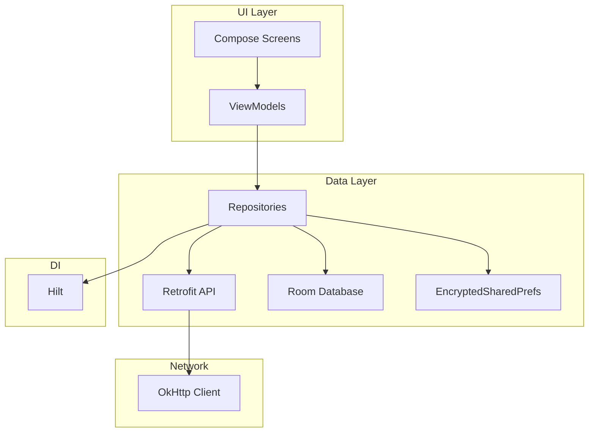
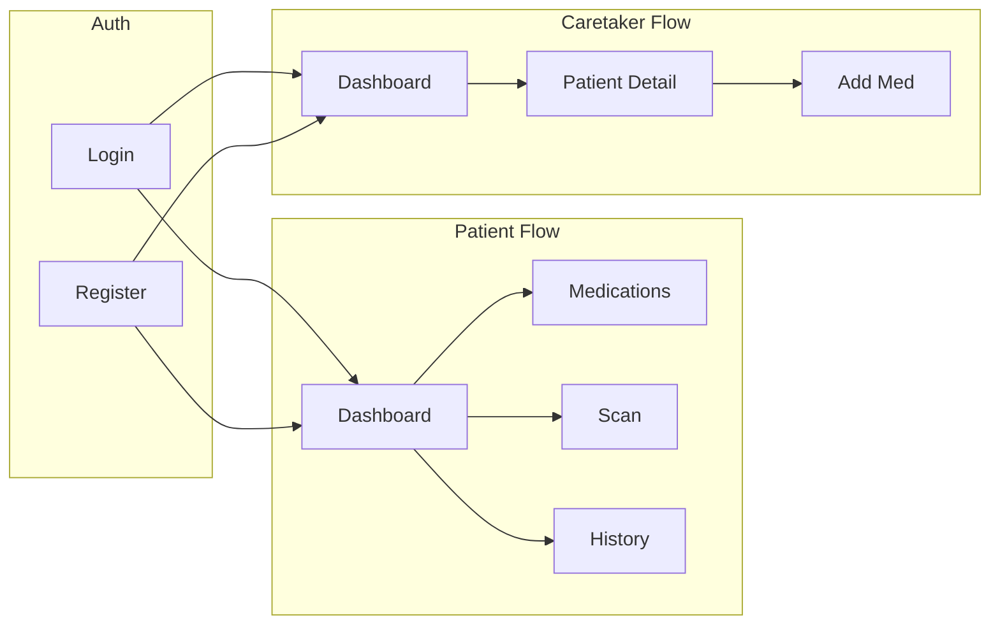
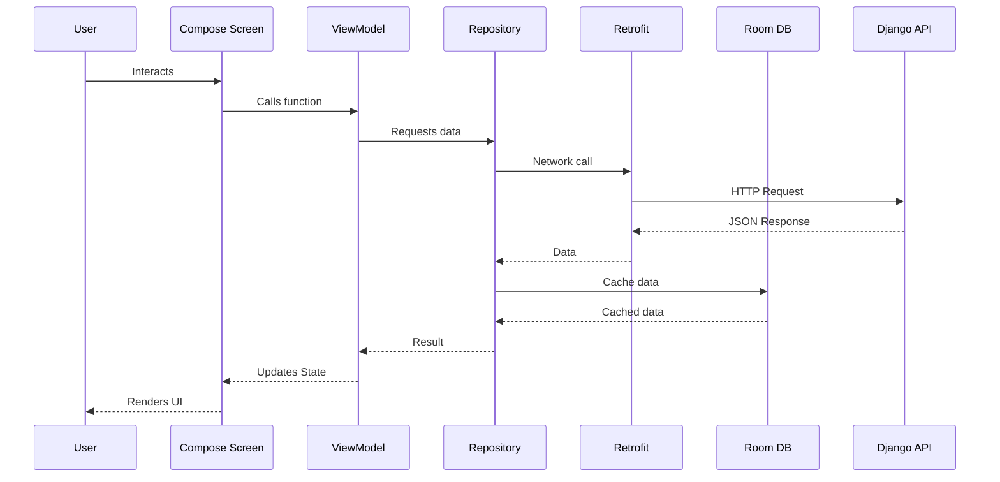

# MedAssist - AI-Powered Medication Adherence System (Android)

A Kotlin Android app built with Jetpack Compose for managing medication adherence. Supports both patient and caretaker roles with real-time schedule tracking, prescription scanning, and AI-powered adherence predictions.

## Architecture



## Navigation Flow



## Data Flow



## Tech Stack

| Category | Technology |
|----------|------------|
| Language | Kotlin |
| UI | Jetpack Compose + Material Design 3 |
| Architecture | MVVM + Clean Architecture |
| Networking | Retrofit + OkHttp |
| Local Storage | Room Database |
| DI | Hilt |
| Async | Kotlin Coroutines + Flow |
| Security | EncryptedSharedPreferences |
| Navigation | Navigation Compose |
| Notifications | AlarmManager |

## Project Structure

```
app/src/main/java/com/medassist/app/
├── MedAssistApp.kt              # Application class + notification channel
├── MainActivity.kt              # Single activity entry point
├── data/
│   ├── api/
│   │   ├── ApiService.kt        # Retrofit interface
│   │   ├── AuthInterceptor.kt   # JWT Bearer token
│   │   └── TokenRefreshInterceptor.kt
│   ├── local/
│   │   ├── MedAssistDatabase.kt # Room database
│   │   ├── dao/
│   │   │   ├── MedicationDao.kt
│   │   │   └── ScheduleDao.kt
│   │   └── entity/
│   │       ├── MedicationEntity.kt
│   │       └── ScheduleEntity.kt
│   ├── model/
│   │   ├── AuthModels.kt
│   │   ├── PatientModels.kt
│   │   ├── MedicationModels.kt
│   │   ├── AdherenceModels.kt
│   │   ├── PrescriptionModels.kt
│   │   ├── ScheduleModels.kt
│   │   └── PredictionModels.kt
│   └── repository/
│       ├── AuthRepository.kt
│       ├── MedicationRepository.kt
│       ├── AdherenceRepository.kt
│       ├── PrescriptionRepository.kt
│       └── PredictionRepository.kt
├── di/
│   ├── AppModule.kt
│   └── NetworkModule.kt
├── ui/
│   ├── navigation/
│   │   └── NavGraph.kt
│   ├── auth/
│   │   ├── LoginScreen.kt
│   │   ├── RegisterScreen.kt
│   │   └── AuthViewModel.kt
│   ├── patient/
│   │   ├── PatientDashboardScreen.kt
│   │   ├── PatientDashboardViewModel.kt
│   │   ├── MedicationListScreen.kt
│   │   ├── ScanPrescriptionScreen.kt
│   │   └── HistoryScreen.kt
│   ├── caretaker/
│   │   ├── CaretakerDashboardScreen.kt
│   │   ├── CaretakerDashboardViewModel.kt
│   │   ├── PatientDetailScreen.kt
│   │   ├── PatientDetailViewModel.kt
│   │   ├── AddMedicationScreen.kt
│   │   └── AddMedicationViewModel.kt
│   ├── common/
│   │   ├── MedicationCard.kt
│   │   ├── AdherenceChart.kt
│   │   ├── LoadingScreen.kt
│   │   └── ErrorScreen.kt
│   └── theme/
│       ├── Color.kt
│       ├── Theme.kt
│       └── Type.kt
└── util/
    ├── TokenManager.kt
    ├── AlarmScheduler.kt
    ├── NetworkUtils.kt
    └── Constants.kt
```

## Screens

### Authentication
| Screen | File | Purpose |
|--------|------|---------|
| Login | `ui/auth/LoginScreen.kt` | Email/password login |
| Register | `ui/auth/RegisterScreen.kt` | User registration with role |

### Patient
| Screen | File | Purpose |
|--------|------|---------|
| Dashboard | `ui/patient/PatientDashboardScreen.kt` | Today's meds, streak, stats |
| Medications | `ui/patient/MedicationListScreen.kt` | Active medications |
| Scan | `ui/patient/ScanPrescriptionScreen.kt` | OCR prescription scan |
| History | `ui/patient/HistoryScreen.kt` | Adherence history |

### Caretaker
| Screen | File | Purpose |
|--------|------|---------|
| Dashboard | `ui/caretaker/CaretakerDashboardScreen.kt` | Patient overview |
| Patient Detail | `ui/caretaker/PatientDetailScreen.kt` | Meds, adherence, predictions |
| Add Medication | `ui/caretaker/AddMedicationScreen.kt` | Add new medication |

## Features

### Patient Features
- Dashboard with today's medication schedule
- "Take" medication button with time logging
- Adherence streak display
- Full medication list with details
- Prescription scanning with OCR
- Adherence history with date filtering
- Medication reminder notifications

### Caretaker Features
- Patient list with search
- Patient detail with tabs (medications, adherence, predictions)
- Add/edit medications
- View AI-generated risk predictions
- Adherence statistics and charts

### Technical Features
- JWT authentication with auto-refresh
- Offline caching with Room
- Encrypted token storage
- Network connectivity observation
- Material Design 3 theming

## Setup

1. **Open in Android Studio** (Arctic Fox or later)
2. **Sync Gradle dependencies**
3. **Configure API URL** in `app/build.gradle.kts`:
   ```kotlin
   buildConfigField("String", "BASE_URL", "\"http://192.168.1.X:8000/api\"")
   ```
4. **Run** on emulator or device (minSdk 26 / Android 8.0)

### API URL Configuration

| Environment | URL | Description |
|-------------|-----|-------------|
| Emulator | `http://10.0.2.2:8000/api` | Maps to host localhost |
| Physical Device | `http://192.168.X.X:8000/api` | Your computer's IP |

## Design Principles

- **Accessibility**: Large tap targets (48dp minimum)
- **Elderly-friendly**: Clear, readable fonts (16sp body minimum)
- **Medical theme**: Teal/cyan color scheme (#0891B2)
- **Status colors**: Green (taken), Red (missed), Yellow (late)

## Known Issues & Improvements

### Critical
- Patient ID management after login
- Token refresh could cause infinite loops

### Moderate
- No offline mode for first launch
- No email/password validation
- Prescription scanning lacks manual review
- No medication update UI

### Minor
- Missing error handling in interceptors
- No pull-to-refresh on all screens
- Timezone handling issues
- Alarms not cancelled on logout
