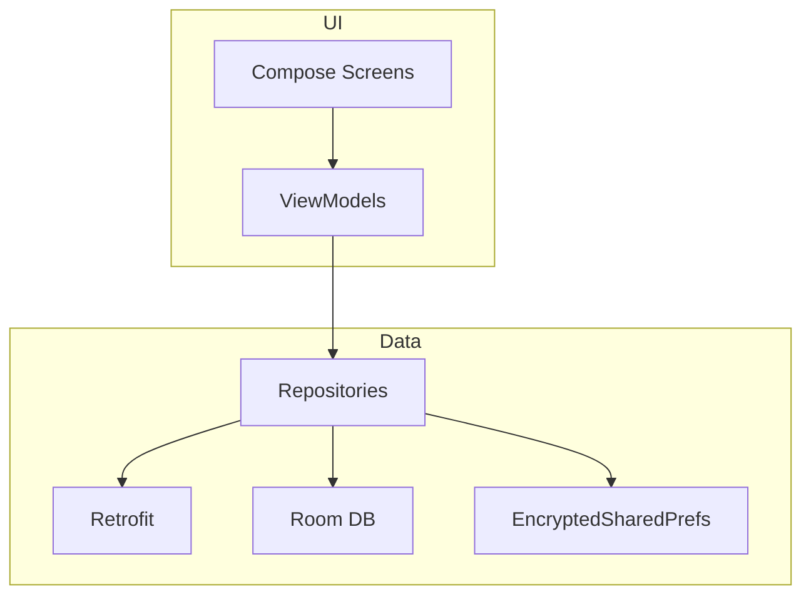
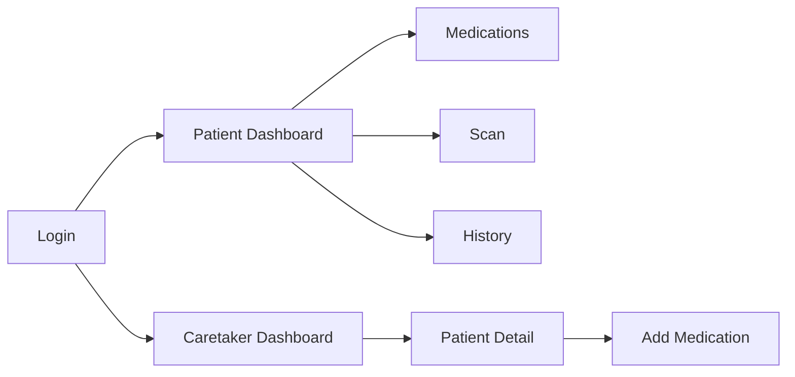

# MedAssist Mobile App

Kotlin Android app with Jetpack Compose.

## Architecture

## Navigation

## Tech Stack

- Kotlin
- Jetpack Compose
- Material 3
- MVVM + Hilt
- Retrofit + OkHttp
- Room
- Navigation Compose

## Setup

1. Open in Android Studio
2. Update BASE_URL in build.gradle.kts
3. Run on device/emulator
